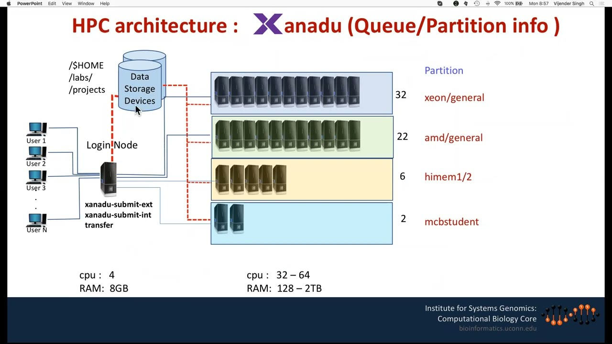

# The Unige Clusters: Baobab, Yggdrasil, and Bamboo (WIP)

The University of Geneva hosts and manages three computing clusters, two of which are (at the time of this writing) available to everyone to use:
 - Baobab, the largest cluster.
   - Baobab is hosted at Uni Dufour, the primary admin center of Unige, and has the largest number of computing resources (CPU and GPU alike) available
 - Yggdrasil, the astronomy cluster (open to all use however)
   - Yggdrasil is hosted near Versoix and is a smaller cluster with fewer CPU and GPU resources. Data between Baobab and Yggdrasil is not synced.
 - Bamboo, the planned cluster
   - Bamboo has been in the works for several years and should be online soon-ish, and will host additional capacity at Biotech. It's currently not clear whether This will replace Baobab or not, but the plan seems to be yes.

The official cluster documentation can be found [at the Unige HPC docs website](https://doc.eresearch.unige.ch/). This document is meant to introduce you to how clusters in general work, as the official documentation assumes some degree of familiarity with HPC systems. **For specifics on how to use the Unige clusters, you should refer to the official documentation.**

You can also learn about specific commands using the `man` linux command. This is a general tool to read the `man`ual for any given linux command. For example, to read the manual for the `sbatch` command you would type `man sbatch` into the terminal.

**NOTE:** Right now all Unige clusters are *free to use for all Unige groups*, but this may be changing in the near-ish future. It may be that eventually we will need to pay a small amount (<0.02 CHF/core-hour) to use the clusters. This is still being discussed, but it's worth keeping in mind.

## Why bother with the cluster?

This document is a long read, and learning to use clusters for computing is a time-consuming task. Why bother?

Once you know how to use a cluster, entireley new possibilities open up for your research. You can run analyses that would take days on your laptop in a few hours, or run **analyses that would be impossible on your laptop**. You can also run many analyses at the same time, and not have to worry about your laptop being tied up for days at a time.

Once you know how to use a cluster the time it takes to convert an existing script or analysis to run on the cluster is usually very short. The time it takes to learn how to use the cluster is usually a few days, and the time it takes to convert a script to run on the cluster is usually an hour at most.

## How clusters work

In general a compute cluster can be thought of as a big herd of individual computers. Clusters often have 500+ "Nodes", which are actually rack-based computers something like this:

<div style="text-align: center;">

</div>
<span class="caption" style="text-align: center;">A typical example of what part of a supercomputer will look like. Each of the red "slices" within a single rack is a single node in the cluster.</span>

Nodes in a cluster, i.e. individual machines, may not always have the same hardware (number of CPUs, RAM, GPU, etc.) but are all accessible through the cluster system.

Every node in the cluster is **fully interconnected** with all of the other nodes, and they share a **common file system, operating system, and software stack**. This means that you can run a program on any node in the cluster and access the same data and software as you would on any other node.

### The login node

The herd of nodes is managed by the **login node**, which is a special node that should **never be used for computation**. The login node is the only node that you can directly log into, and it is used to submit jobs to the cluster. Accessing any other node will depend on whether you have been allocated a job from the login node.

The login node is shared by all users, and can be accessed from anywhere on the internet. This means that you can submit jobs to the cluster from your laptop even when not at the Uni. The login node is also the only node that has access to the internet, so you can use it to download data or software that you need for your jobs. However, you should **never** run computations on the login node, as this will slow down the login node for everyone else.

### The scheduler

The login nodes hosts a **scheduler** (which also lives on a few other hidden management nodes), which is a program that manages the allocation of jobs to the nodes in the cluster. The scheduler is responsible for making sure that all jobs are run in a fair and efficient manner, and that no single user can monopolize the cluster.

The scheduler will take care of starting your job on the cluster, and will also take care of stopping your job when it is done. The scheduler will also take care of making sure that your job has access to the resources that it needs, and that your job is not interrupted by other jobs.

All Unige clusters use a program called **SLURM** as the scheduler. You can only interact with SLURM from the command line, and it offers many utilities for managing your jobs.

### Partitions

Within the cluster there are different **partitions** for different types of jobs that you can run. Depending on whether you need only a few CPUs for a very long time, many CPUs for a shorter amount of time, or GPUs you will select different partitions.

Partitions are groups of nodes within the cluster that are tasked with dealing with different types of jobs. Each partition has a separate queue, and when you request a job allocation from the SLURM scheduler your job will be placed in the queue for the partition that you requested. When there are enough available machines for your job to run, the scheduler will start your job on those machines, after the previous jobs in the queue have been allocated.


### Storage

The cluster has a **shared file system** that is accessible from all nodes in the cluster. This means that you can store your data on the shared file system and access it from any node in the cluster. The shared file system is also accessible from the login node, so you can use it to store your data and software.

There are several components to the shared file system, but without getting into particulars there are two directories you can rely on no matter what you're doing:
 - The **home directory** is where you should store your code and scripts. This directory is backed up regularly, and you should only keep up to about 200GB of data here (the cluster admins get ornery otherwise). This can be found at `/home/$USER/` and is the default directory when you log in.
  - The **scratch directory** is where you should store your large data or intermediate analysis results. This directory is not backed up, and you can store as much data as you want here. This can be found at `/home/$USER/scratch/`.

Because the cluster relies on a **network file system**, it will be slower to access data sometimes than you're used to. This especially happens when you need to access a very large number of small files. More on this later.

### Bringing it all together

So in summary, the cluster consists of a:
 - Login node, which you can use to submit jobs, download data and software, and manage your files
 - Scheduler, which manages the allocation of jobs to the nodes in the cluster and takes job requests from the login node
 - Partitions, which are groups of nodes that are tasked with dealing with different types of jobs and have separate queues
 - Network file system, which is accessible from all nodes in the cluster and is used to store your data and software

This diagram is taken from the UConn HPC documentation, but it's a good representation of how a cluster works in general:

<div style="text-align: center;">
 
</div>

## Running jobs on the cluster

Knowing all this, we can consider how to actually run jobs on the cluster. But before that a question arises: **why would you want to run jobs on the cluster in the first place?**

### Why and when do I use the cluster?

Cluster computing is useful for a few reasons:
 - **Parallel computing**: If you have a job that can be split into many smaller jobs that can be run at the same time, you can run them all on the cluster and get your results faster.
 - **Large memory requirements**: If you have a job that requires more memory than your laptop or desktop can provide, you can run it on the cluster. Cluster nodes can have up to 1TB of RAM.
 - **GPU computing**: If you have a job that requires a heavy-duty GPU, you can run it on the cluster.
 - **Long running jobs**: If you have a job that will take a long time to run, you can run it on the cluster and not have to worry about your laptop or desktop being tied up for a long time. You can also run jobs that will take days or weeks to run.

The usual trend among people in neuroscience is to just let jobs run on their laptop/desktop for a few days when necessary. This really slows down the pace of results, and can also mean that you only discover after a few days that you made a mistake in your code. 

In general, I personally find that **if a script or analysis takes more than 1 hour to run on my machine, I should be running it on the cluster**. 

How much faster a job will run on the cluster depends on your **bottleneck** within the script. Some analyses require a lot of computation to run, and so they are **CPU-constrained**. Other jobs might require a very large amount of RAM. On desktops and laptops when the machine runs out of RAM it starts using swap space (or paging to disk) which is much slower. These jobs are **memory-constrained**. Finally, some jobs require a lot of data to be read from disk, and so they are **I/O-constrained**.

Generally you can see improvements of 10-100x speed on CPU-constrained tasks, and variable speedups on memory-constrained tasks. I/O-constrained tasks will not see much improvement, and may even be slower on the cluster. Usually the best option there is to optimize your code to read less data from disk, or to use a different storage system (SSD instead of HDD, for example).

### "Embarassing" parallelism

One of the most common reasons to use the cluster is for **parallel computing**. This is when you have a job that can be split into many smaller jobs that can be run at the same time. This is called **embarassing parallelism** because it's so easy to do. Personally 95% of the jobs I run on the cluster are embarassingly parallel, and usually there is some way to make most computationally-intensive tasks embarassingly parallel.

A key aspect of embarassingly parallel computing is that the **individual tasks don't need to talk to one another.** Some examples of this are fitting a model to many different datasets, running the same analysis on many different subjects, or running the same analysis with many different parameters. Instead of running these tasks in a big for loop on your laptop, you can run them all at the same time on the cluster as separate jobs.

If you cannot split your task into many independent smaller tasks, you may have a job that is either:
 - Inhenrently serial, and cannot be parallelized. This is when you have a job that requires the output of one step to be the input of the next step. These jobs will not run faster on the cluster.
 - Requires general **distributed computing** techniques, and involves tasks that can be run in parallel but must communicate with one another.

In the first case you may be able to optimize your code to run faster, or you may just have to accept that the job will take a long time to run.
 
In the second case you are now staring into the abyss. This is kind of like the trolley problem for your own time and sanity. You will either give up on distributing the task and suffer from slow results, or sacrifice your sanity and time to learn how to use complex distributed computing techniques like MPI, Dask, Ray, or Spark. There is no good outcome, only less bad ones.

### How to run jobs on the cluster with job scripts

To run a job on the cluster you will need to:
 - Write a script that you want to run on the cluster
 - Write a **job script** that tells the scheduler how to run your script
 - Submit your job script to the scheduler

The job script is a shell script that tells the scheduler what resources your job needs, how long your job will run, and what program your job will run. The job script is written in a language called **bash**, which is the default shell on Unix systems.

Job scripts are usally quite simple, and contain a header that tells the scheduler what resources your job needs, and a body that tells the scheduler what script your job will run. Here is an example of a job script that runs a Python script:

```
#!/bin/bash
#SBATCH --job-name=my_job
#SBATCH --output=my_job.out
#SBATCH --error=my_job.err
#SBATCH --time=1:00:00
#SBATCH --mem=1G
#SBATCH --cpus-per-task=1
#SBATCH --partition=shared-cpu

python my_script.py arg1 arg2
```

The header specifies what the job will be called, what file the output of the script will be written to (whatever you would normally see on the terminal if you run it locally), where any errors will go if they occur, how long the job will be allocated to run (this is an **upper bound**, it can run less than that but will be forcefully stopped after that time), how much memory the job will need (1GB), how many CPUs the job will need (only 1), and what partition the job will run on.

At the end of the job script is the command that will run your script. In this case it's running a Python script called `my_script.py`. This is a script that takes several arguments (in this case `arg1` and `arg2`). You can run any program you want in the job script, as long as it's installed on the cluster.

This job script is then **submitted to the scheduler** using the `sbatch` command. This command will take the job script as an argument, and will submit the job to the scheduler. The scheduler will then allocate resources to the job, and will start the job on the cluster.

```
sbatch my_job.sh
```

You can then check the status of your job using the `squeue` command. This will show you all of the jobs that are currently running on the cluster, and will show you the status of your job. This command by default will dump a list of all jobs running on the cluster on all partitions. You can filter this down using the `--partition=partition_name` flag to see only a specific partition, and the `--user=$USER` flag to see only your jobs.

```
$ squeue --user=gercek
JOBID  PARTITION     NAME     USER ST       TIME  NODES NODELIST(REASON)
    1 shared-cpu   my_job   gercek  R       0:10      1 node1   
```

This output indicates that the job `my_job` is running on the `shared-cpu` partition, and has been running for 10 minutes. The job is running on the node `node1` and is only using one node. The `ST` column indicates status, and the `R` indicates that the job is running.

When the job is done, the output and error files will be written to the files that you specified in the job script. You can then look at these files to see the output and errors of your job.

For a detailed list of partitions and their limits (run time, number of CPUs, etc.) you can use the `sinfo` command. This will show you all of the partitions on the cluster, and will show you the limits of each partition. You can also check the [HPC documentation here.](https://doc.eresearch.unige.ch/hpc/slurm#partitions)


### How to run jobs on the cluster with interactive terminal sessions

Sometimes you may want to access many CPUs, GPUs, or a lot of memory interactively. This is useful when you are debugging a script, or when you are running a script that requires a lot of resources and you want to see the output in real time. It's not ideal to run this kind of task in a job script because you won't be able to run commands interactively.

You can request resources from the scheduler for an interactive session using the `salloc` command. This command will take the same arguments as the `sbatch` command's header, and will allocate resources to you interactively. You can then run commands on the allocated resources as if you were running them on the login node.

For example, here we can request an interactive session with 4 CPUs and 8GB of memory on the debug partition, which is reserved for very short testing jobs (<15m):

```
gercek@login2:~$ salloc -c4 --mem=8G -t 00:10:00 -p debug-cpu
salloc: Pending job allocation 10020179
salloc: job 10020179 queued and waiting for resources
salloc: job 10020179 has been allocated resources
salloc: Granted job allocation 10020179
salloc: Waiting for resource configuration
salloc: Nodes cpu001 are ready for job
gercek@cpu001:~$
```

Notice that the prompt has changed in the final line, indicating that you are now on the node `cpu001`. You can now run commands on this node as if you were running them on the login node. When you are done with the interactive session you can exit the session using the `exit` command.

### Remote desktop access on the cluster

The Unige clusters also support remote desktop access of the clusters using a program called X2Go. This is useful when you need to run a program that requires a graphical interface, such as FreeSurfer. You can install X2Go on your laptop or desktop, and then connect to the cluster using the IP address of the login node. **Note that by default this will create the graphical interface on the login node! Don't run any computation here!**

If you would like to run e.g. FreeSurfer on a compute node, you can open an X2Go session on the login node, and then open a terminal and use the same `salloc` request as above. The session will automatically switch to the compute node once your allocation is granted.

**I strongly recommend against using this feature**. X2Go on the Unige clusters is very unstable, and you will often find that your session will crash or freeze. It's much better to run your jobs using job scripts or interactive sessions.

You can alternatively run a GUI application via X forwarding over SSH. This is a bit more complicated, but it's more stable than X2Go. Figuring this out is left as an exercise to the reader.

### OpenOnDemand (Jupyter notebooks and VS Code)

A new and experimental feature on the cluster is a service called "OpenOnDemand" which allows for a web-based interface for launching a number of pre-built apps including Jupyter notebooks and a VS Code like instance. This is a great way to run code interactively on the cluster, and is especially useful for running code that requires a interactive plotting in a jupyter framework.

[The documentation for using the service is here](https://doc.eresearch.unige.ch/hpc/how_to_use_openondemand)

And you can access the service at [the OOD host for Baobab, which is the only cluster that has implemented it.](https://openondemand.baobab.hpc.unige.ch). Note that you will need to log in with your Unige account. Currently this service is in beta testing so you will need to request access on the [HPC community forums](https://hpc-community.unige.ch/t/baobab-openondemand-is-now-available/).

